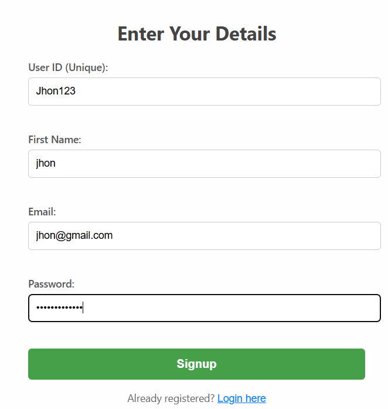
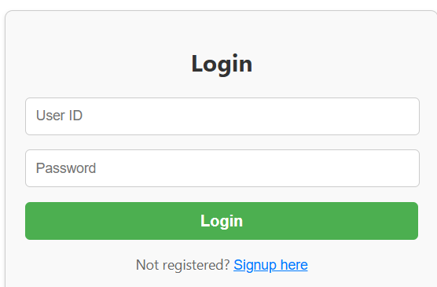
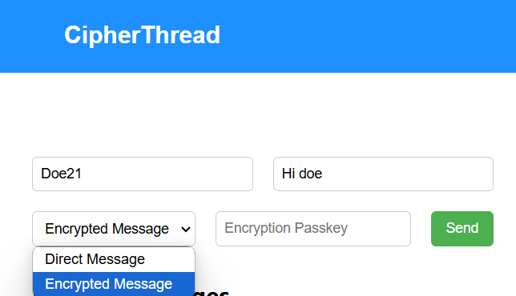
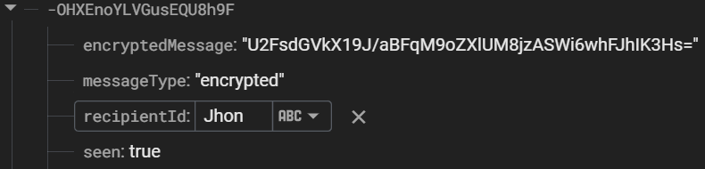
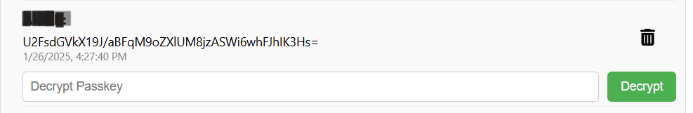
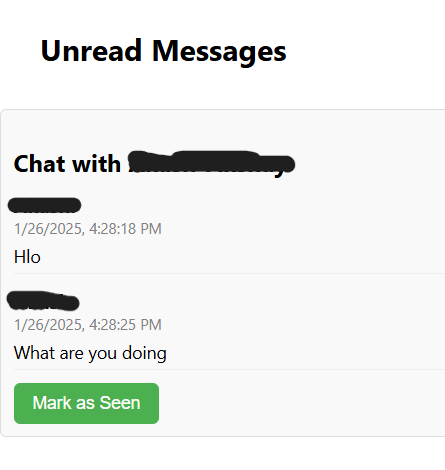
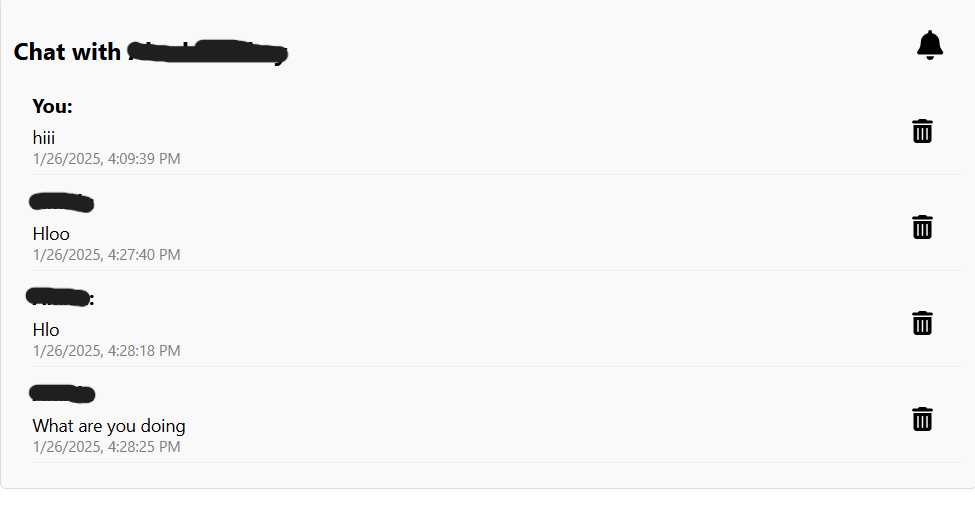
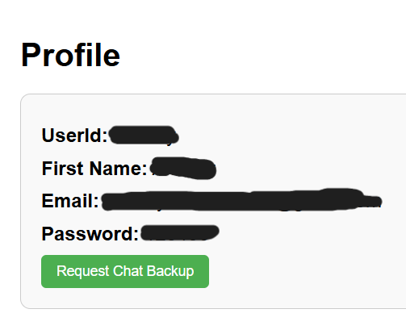

# CipherThread

## You can access the Application Here:[CipherThread](https://cipherthread.onrender.com/)

**CipherThread** is a chat application that provides end-to-end encrypted messaging, with additional features such as dynamic passkey generation.

## Features

- **Encrypted messaging**: Send encrypted messages with a passkey.
- **Dynamic passkey generation**: Generate a unique passkey for encrypted messaging.
- **Unread message notifications**: Mark messages as seen.
- **Message deletion**: Delete chat messages.
- **Mobile and desktop support**: Works seamlessly across devices.

---

## How to Use CipherThread

### 1. **Signup**

- If you are the new user then create a Profile by Signup.
- Enter Unique Username.
- Enter your Details.
- Click on Signup button.



---

### 2. **Login**

- After opening the app, you'll be prompted to log in.
- Enter your credentials to access your chat.



---

### 3. **Send a Message**

- Type the recipient's **user ID** and the **message**.
- Choose the message type:
  - **Direct**: Regular message.
  - **Encrypted**: Message with encryption (you will need a passkey).
- Send the message



---

### 4. **End-to End Encryption**

- The Encrypted message is stored in the Database in Encrypted Format.
- As shown in the below only the sender and receiver knows the Encrypted message



---

### 5. **Decrypt a Message**

- If a message is encrypted, enter the **passkey** to decrypt it.
- Decrypt a message by clicking the **Decrypt** button.



---

### 6. **Unread Messages**

- Any unread messages will be displayed at the top of the chat.
- Mark messages as **seen** once you've read them.



---

### 7. **Chats**

- Once a conversation is started, it will appear under **Chats**.
- You can click on any chat to view the full conversation.
- You can delete individual messages from the chat as well.



---

### 8. **Profile**

- you can see you details in Profile Section.
- Click on the Username at top right to access the Profile details.



---

### 9. **Chat Backup**

- You can request for a chat Backup on the Profile page.

---

### 10. **Mobile View**

- On mobile devices, clicking on a chat will navigate you to the chat page.
- You can still send and decrypt messages as usual.

---

# 📜 Contribution Guidelines

## 🌟 How to Contribute?

**We welcome contributions from the community! Follow these steps to get started:**

### 🍴 Fork the Repository
Click on the **Fork** button at the top-right corner of this repo. This will create a copy of the repository in your GitHub account.

### 💻 Clone the Repository

```bash
git clone https://github.com/SrigadaAkshayKumar/chatapp-frontend.git
cd chatapp
```

### 🌿 Create a New Branch

```bash
Copy
git checkout -b feature-branch-name
```

### 🛠 Make Your Changes
Implement your feature, fix a bug, or improve documentation. Follow best coding practices and maintain clean, readable code.

### ✅ Commit Your Changes

```bash
Copy
git add .
git commit -m "Added [Feature/Fix]: Short Description"
```

### 🚀 Push to Your Fork

```bash
Copy
git push origin feature-branch-name
```

### 🔀 Create a Pull Request

- Go to the original repository on GitHub. Click on "New Pull Request". Select your fork and branch, then submit the pull request.

### 📢 Contribution Rules
## **📌 Follow these rules to ensure smooth collaboration:**

**✔️ Code Quality: Follow clean coding principles and maintain proper indentation.**

**✔️ Descriptive Commits: Write meaningful commit messages.**

**✔️ Issue First: Always open an issue before making major changes.**

**✔️ Respect PR Reviews: Make necessary improvements as suggested by maintainers.**

**✔️ No Plagiarism: All contributions must be original work.**

**✔️ Be Respectful: We value a friendly and inclusive community.**

### 💡 Need Help?

- If you have any questions, feel free to open an issue or start a discussion. We're happy to help! 🚀
